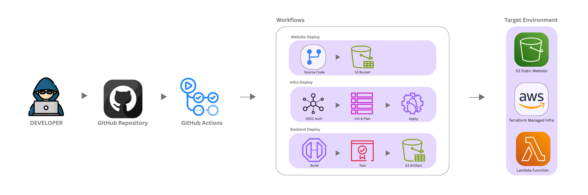

# 🧭 SERVERLESS ARCHITECTURE

The **Serverless Architecture Project** replicates real-world **deployment and operations** practices using fully managed AWS services. It demonstrates how a modern static web application can be hosted, delivered, and maintained entirely through **serverless components**, following DevOps best practices for reliability, automation, and scalability.

🔗 **Live site:** [serverless.anandmathew.site](https://serverless.anandmathew.site)

The goal is to design an environment that **mimics production standards** — including **environment isolation**, **branch-based workflows**, and **automated pipelines** for both application and infrastructure updates. Every cloud resource is provisioned via **Infrastructure as Code (Terraform)** and integrated with **GitHub Actions CI/CD** for continuous delivery using **OIDC-based authentication** (no static credentials).

Development follows an **iterative version plan**, where each release adds enhancements aligned with **DevOps**, **SecOps**, **FinOps** and **AIOps** principles. All version updates, improvements, and future experiments are tracked transparently through the project’s [`CHANGELOG.md`](CHANGELOG.md).

---

## 🧰 Architecture & Components

*Figure 1: Serverless Architecture – 3-Tier Design (Frontend, Backend, and Database Layers)*

| Category | Tool / Service | Purpose & Usage |
|-----------|----------------|----------------|
| **Infrastructure as Code (IaC)** | **Terraform** | Automates provisioning of all AWS resources. Manages remote state via S3 and DynamoDB for reliability and state locking. |
| **Cloud Storage & Hosting** | **Amazon S3** | Hosts static frontend content (`index.html`, assets, styles, scripts). Separate S3 buckets for Dev and Prod environments, managed entirely via Terraform. |
| **Serverless Backend** | **AWS Lambda + API Gateway + DynamoDB** | Implements a dynamic visitor counter API. Frontend interacts with the API for real-time visitor tracking. |
| **Content Delivery & HTTPS** | **Amazon CloudFront** | CDN and HTTPS layer for the production site, improving performance and security through edge caching. |
| **Domain & DNS Management** | **Amazon Route 53** | Manages the root domain `anandmathew.site` and subdomain `serverless.anandmathew.site`. Handles DNS validation for ACM certificates. |
| **SSL Certificates** | **AWS Certificate Manager (ACM)** | Issues and auto-renews TLS/SSL certificates for CloudFront via DNS-based validation. |
| **State Locking** | **Amazon DynamoDB** | Prevents concurrent Terraform operations through state locking, ensuring consistency during deployments. |
| **Version Control & Branching** | **Git & GitHub** | Git repository (`project1-serverless`) follows a two-branch model: `dev` for development, `main` for production releases via pull requests. |
| **Continuous Integration / Delivery (CI/CD)** | **GitHub Actions** | Automates both application and infrastructure deployments. Separate workflows manage Dev, Prod, Web, Backend and Infra operations. |
| **Authentication & Security** | **GitHub OIDC + AWS IAM Roles** | Allows GitHub Actions to assume AWS IAM roles using short-lived tokens, eliminating static credentials and strengthening security posture. |

---

## 🏗️ CI/CD Workflow

*Figure 2: Automated CI/CD Pipeline – GitHub Actions Integration for Infrastructure, Backend, and Frontend Deployments*

This architecture uses a **two-environment serverless design** with complete automation for provisioning, deployment, and delivery.

### Development Workflow (`dev` branch)
- Pushes to `dev` trigger:
  - **`website-dev.yml`** — Syncs web content to Dev S3 bucket.
  - **`infra-dev.yml`** — Runs Terraform `plan` → `apply` in `infra/envs/dev/`.
  - **`backend-dev.yml`** — Builds, tests, and deploys Lambda via S3 artifact upload.
- Enables rapid iteration and testing without impacting production.

### Production Workflow (`main` branch)
- Merges to `main` trigger:
  - **`website-prod.yml`** — Deploys content to the Prod S3 bucket (served via CloudFront).
  - **`infra-prod.yml`** — Runs Terraform `plan` → `apply` in `infra/envs/prod/`.
  - **`backend-prod.yml`** — Deploys backend code and updates Lambda + API Gateway.
- Uses **OIDC-based role assumption** for secure, credential-free AWS access.

---

## 🧩 Versioning & Maintenance

- The project follows an **incremental versioning model**, where each version introduces new components or enhancements.
- All updates, improvements, and experiments are logged in [`CHANGELOG.md`](CHANGELOG.md).
- Git version tags (`v0.1.0`, `v0.2.0`, etc.) are maintained for easy tracking.
- Each release is validated through automated CI/CD pipelines before merging to `main`.

**Infrastructure standards**
- All AWS resources are consistently tagged (`project`, `environment`, `managed`).
- Each environment maintains separate backend configurations, state files, and IAM roles.
- Manual configuration is minimal — Terraform and GitHub Actions manage the entire workflow end-to-end.

---

#### Current Release
> **v0.2.0 – Backend Integration & Automation Enhancements**

#### Previous Release
> **v0.1.0 – Foundation & CI/CD Setup**
